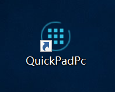

# PC端安装与设置

## 系统要求

PC端软件目前仅支持64位操作系统（如Windows10或64位Windows7）。需要.Net框架4.6.1或以上版本。

## 下载安装

请从[https://quickpad.vip/](https://quickpad.vip/) 下载安装包，解压缩后运行setup.exe程序。

安装后，点击桌面上的“QuickPadPc”快捷方式即可开启。

  

## 注册与登录

首次使用请先注册帐号。点击登录窗口的“注册帐号”按钮。

在注册窗口中输入您的Email地址、密码和昵称，然后点击“注册”即可。Email用于登录以及找回密码，请使用您的真实Email地址。密码需要至少有一个大写字母、一个小写字母和一个特殊字符。

注册后，请使用您的Email地址和密码登录系统。

登录时可以选择让系统保存您的密码，以及打开软件时自动登录。如果您使用的是私人电脑，建议选中这两个选项。

如果Windows弹出安全告警窗口，请选择“允许访问”。PC端软件需要使用网络。

## 基本设置

点击主窗口右侧的齿轮图标，打开设置窗口。

各参数的解释如下：

* 连接端口：PC端软件的服务端口，供手机APP通过局域网连接使用。默认端口为666。请确保您的电脑防火墙软件开放了此端口。
* APP验证码：为了避免其他人的APP连接到您的电脑，可以设置一个验证码。PC端会在APP连接时进行验证。
* 自动登录：软件开启后自动登录帐号。
* Windows开机自动启动：选中后，在Windows开机或重启后，会自动运行PC端软件。建议开启此选项。
* 启动后最小化窗口：PC端软件启动后，自动最小化到屏幕右下角的Windows系统托盘中。

