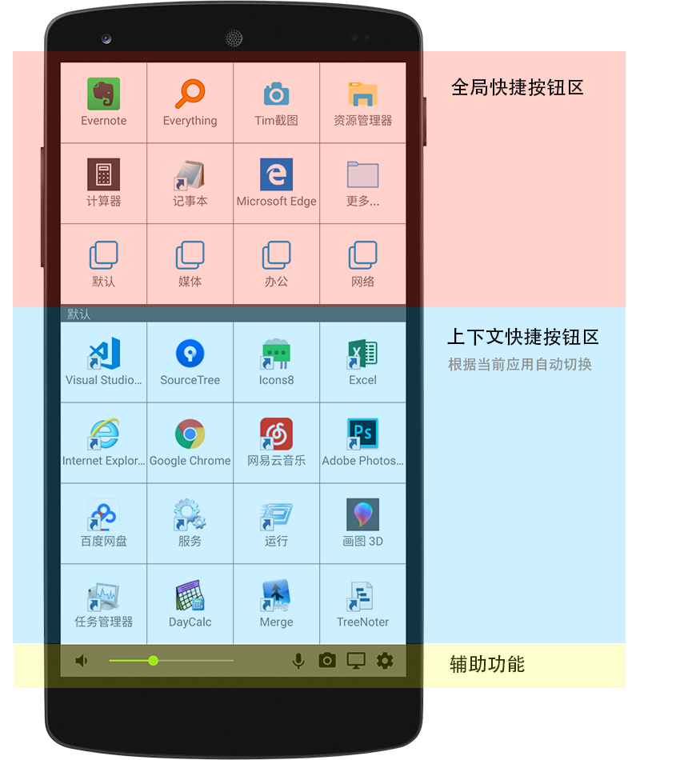

# 概述

## 界面概览

客户端界面分为3个区域。

**全局快捷按钮区域：**动作不随windows当前应用的改变而改变。

**上下文快捷按钮区域：**Windows当前应用改变后，自动更新为针对这个应用所定义的快捷动作。

**辅助功能区域：**提供了一些辅助功能。

点击一个快捷按钮后，PC端软件将在电脑上执行相应的动作。

## 基本概念

**快捷按钮：**界面上用于定义快捷动作的方形按钮。每个按钮可以显示一个图标和一个文字标签。共有12个全局快捷按钮和16个上下文快捷按钮。

**快捷动作：**点击快捷按钮后在电脑上执行的动作内容。比如运行一个程序、打开文件或访问网页等。

**配置文件：**用于（针对特定应用）定义一组快捷动作。当您在Windows上使用这个应用的时候，Quickpad自动切换到该配置文件，客户端的“上下文快捷按钮区域” 显示这个配置文件中定义的快捷动作。 如果没有对某个应用程序定义配置文件，Quickpad将会加载 “默认” 配置文件。

## 基本使用过程

1. 安装和运行PC端软件
2. 在PC端软件中创建账号并登录
3. 在PC端软件中定义快捷按钮和配置文件
4. 使用APP客户端连接PC端软件
5. 点击APP上的快捷按钮执行想要的动作

