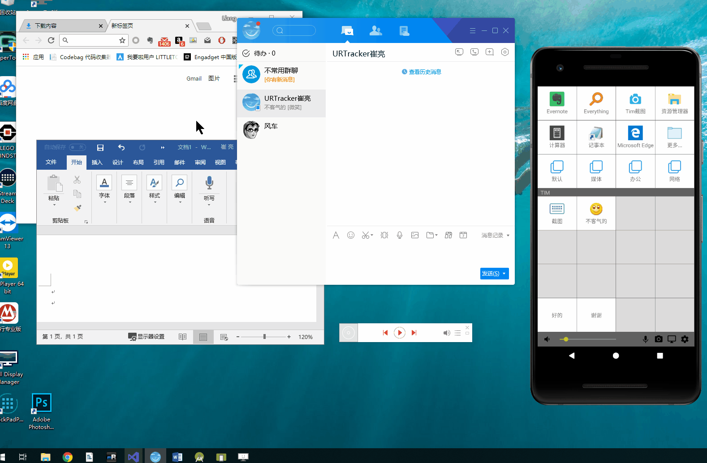
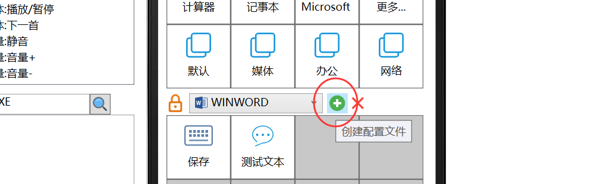
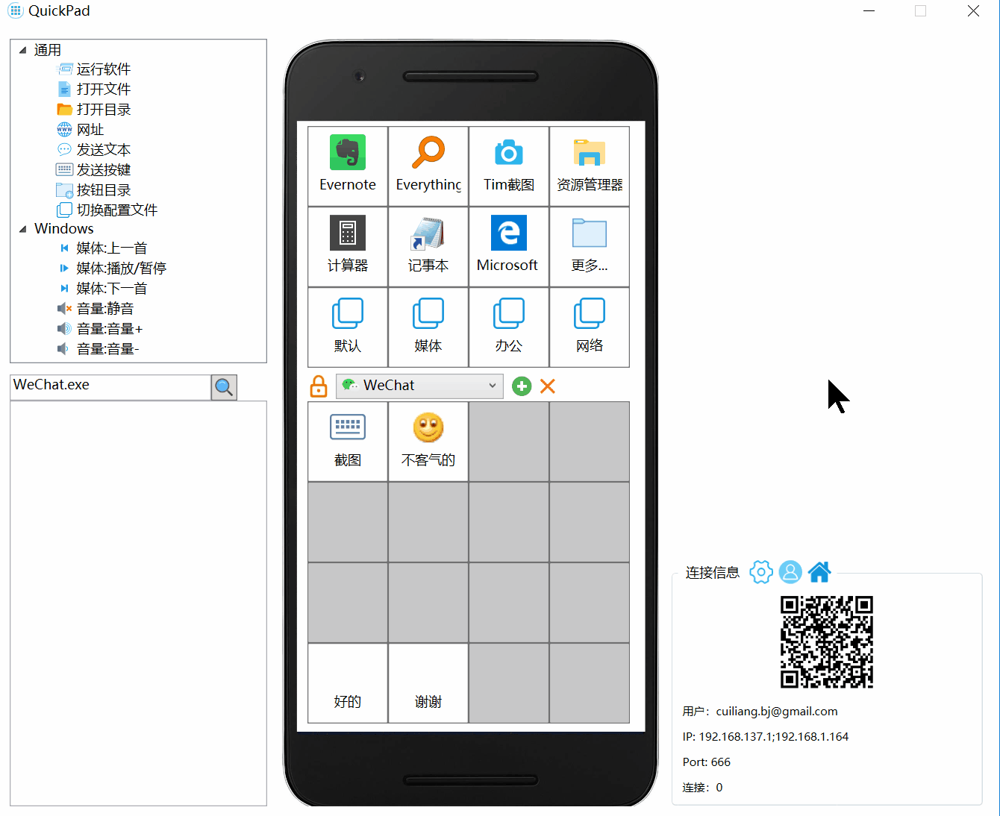

# 配置文件管理

## 概述

配置文件（Profile）用于定义APP下面区域上下文快捷按钮上的动作。

配置文件可以关联一个windows应用程序。当此应用的窗口获得焦点，变为Windows的当前活动窗口时，QuickpadPC程序便可以自动加载对应的配置文件，从而在上下文按钮区域显示针对此应用的快捷动作。

当Windows当前窗口没有匹配的配置文件时，“默认”配置文件会被加载。

## 创建配置文件

点击配置文件下拉框右侧的“加号”按钮，可以创建新的配置文件。

  
在弹出的窗口中：

* 选择配置文件所针对的应用程序（配置文件也可以不针对任何应用程序，这时候只能通过“切换配置文件”动作加载此配置文件。）
* 输入配置文件名称；
* 如果需要，可以从已有的其他配置文件复制快捷动作；

然后点击“保存”即可。

## 定义配置文件的快捷按钮动作

从配置文件下拉框中选择一个配置文件，即可开始对其按钮动作进行设置。

## 配置文件锁定状态

正常情况下，配置文件会跟随Windows当前活动窗口切换。但是，在编辑配置文件时，需要避免配置文件自动切换。这时候可以点击配置文件下拉框前的🔒图标来锁定或解锁配置文件切换功能。

当从下拉框手动选择了一个配置文件时，软件会自动锁定。

在锁定状态下，如果有这些情况发生，锁定会被自动释放：

* 从手机APP中点击了切换配置文件的快捷按钮；
* PC端窗口被最小化；

如果发现Windows窗口改变后，上下文快捷按钮没有变化，可能是因为配置文件切换锁定了。这时候点击🔒图标手动解锁即可。

## 删除配置文件

选择一个配置文件后，点击后面的删除按钮，即可删除这个配置文件。

