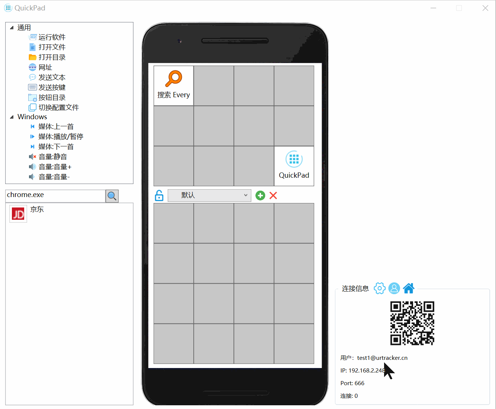
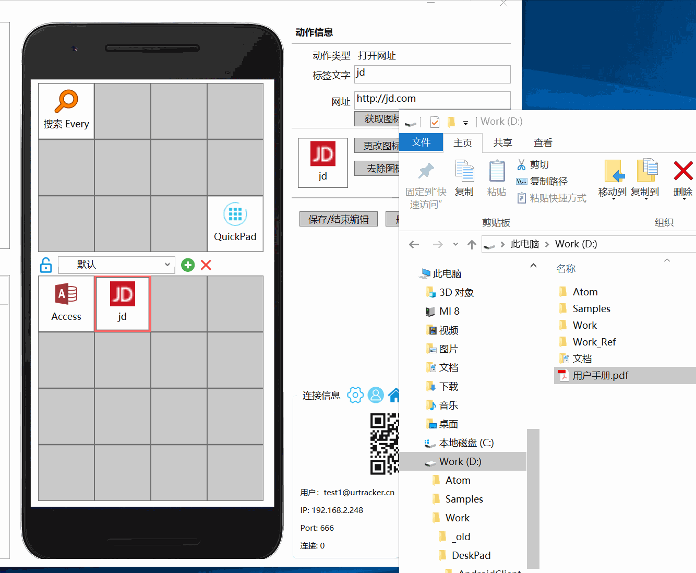
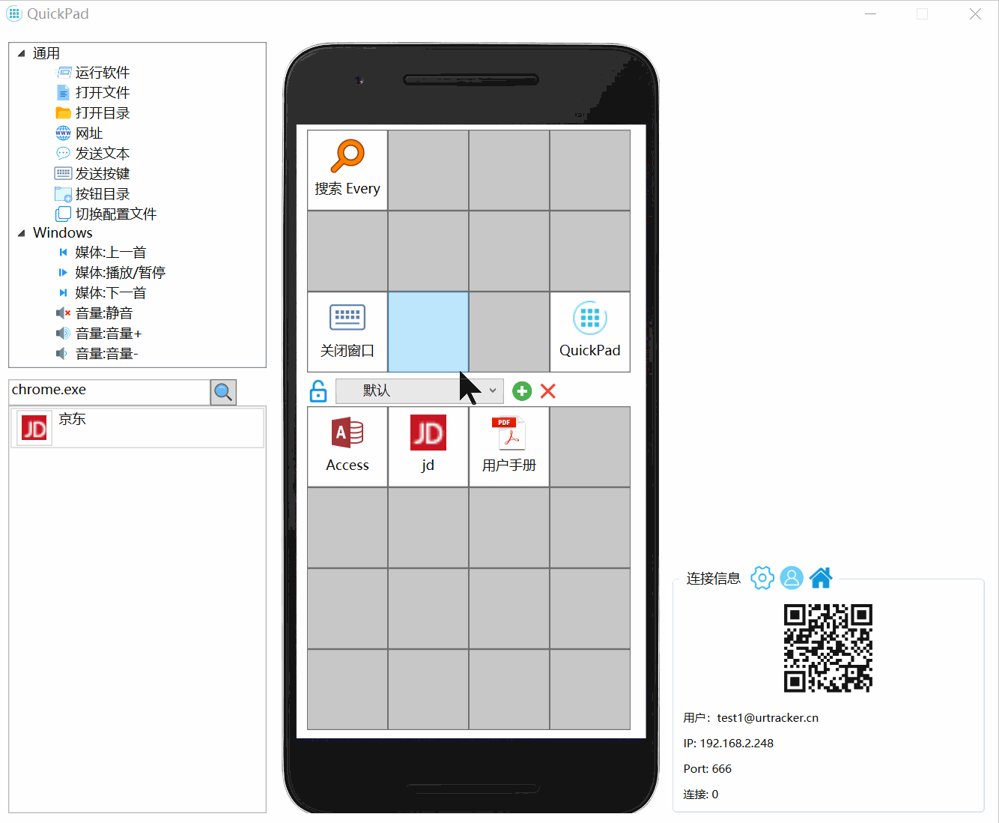
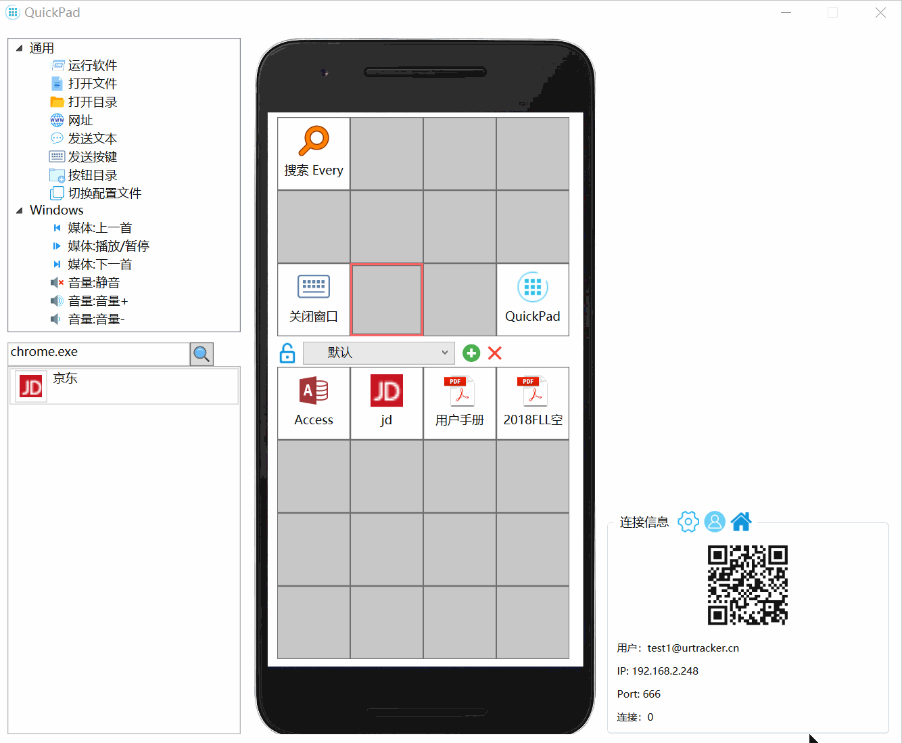
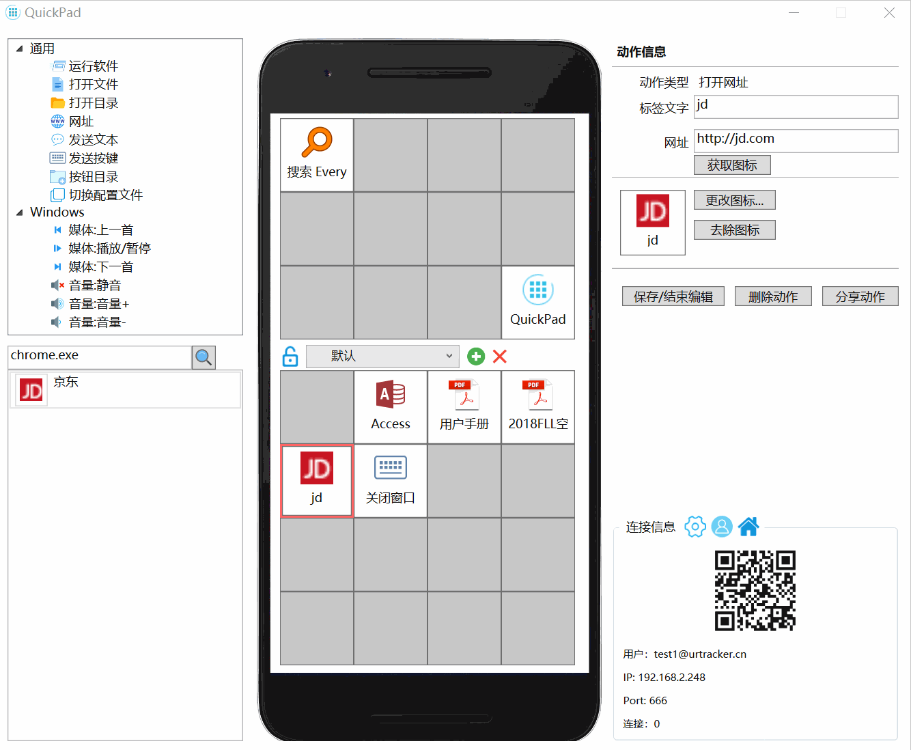
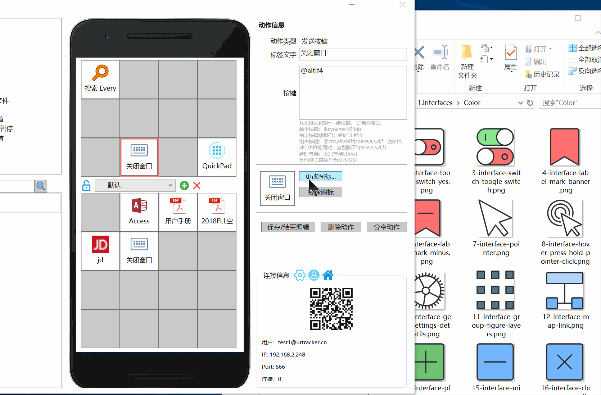
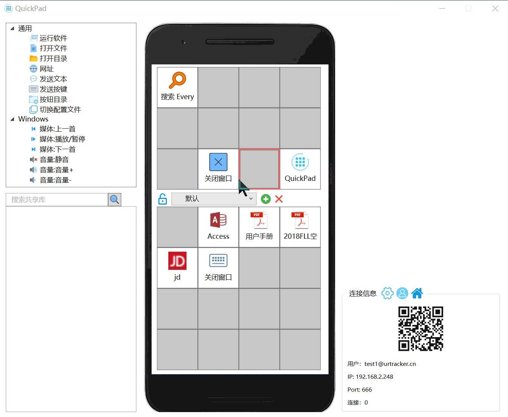
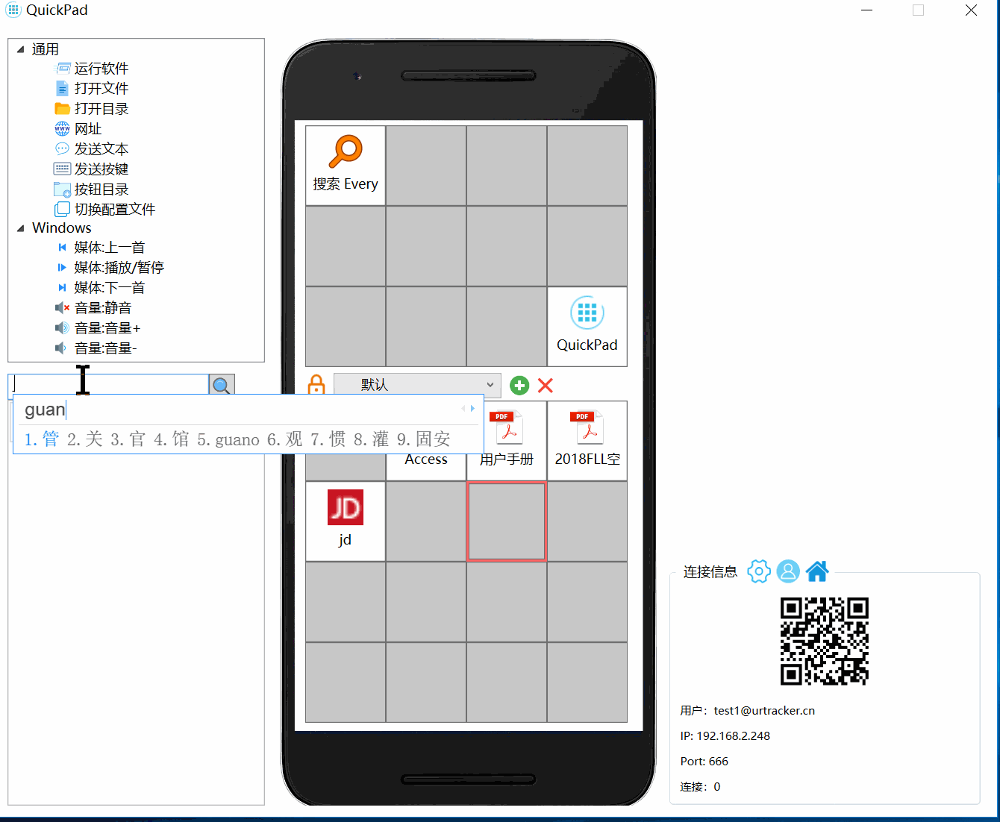

# 设置快捷按钮

## 为按钮设置动作

从左侧工具栏中按住一个动作节点，拖放到目标按钮上松开。

您也可以直接从Windows中拖动文件到按钮，将创建打开这个文件的快捷动作。

## 编辑动作参数

点击要编辑的按钮，在窗口右边将显示动作编辑表单。修改表单参数后，点击保存按钮，或者点击其他快捷按钮即可。

## 删除动作

方式1：点击按钮编辑动作，点击右侧的“删除动作”按钮。

方式2：选中按钮后，按键盘Delete键。

方式3：在按钮上点右键，在弹出的菜单中选择“删除”。

## 移动动作

按住一个按钮，拖动到另外另外一个按钮上即可。 如果目标按钮也有动作，则交换两个动作。 

也可通过右键菜单剪切和粘贴到新的位置。

## 复制动作

在要复制的按钮上点击右键，选择“复制”，然后在空白按钮上点右键选中“粘贴”。

## 修改动作图标

### 更改图标

方式1：点击图标右侧的“更改图标”按钮，在弹出的窗口中选择图标或上传本地图标。

方式2：从windows中拖动图标文件到图标按钮上。

### 删除图标

点击图标右侧的“去除图标”按钮。

## 分享快捷动作

您可以将一些动作分享给其他用户使用。

编辑某个动作按钮，点击“分享动作”按钮。

## 使用共享的快捷动作

您可以使用其他人分享的快捷动作定义。

可以搜索针对某个应用的动作。只要在关键词框内输入程序exe文件名。

选择要编辑一个配置文件时，程序会自动搜索适合此应用的共享动作。

