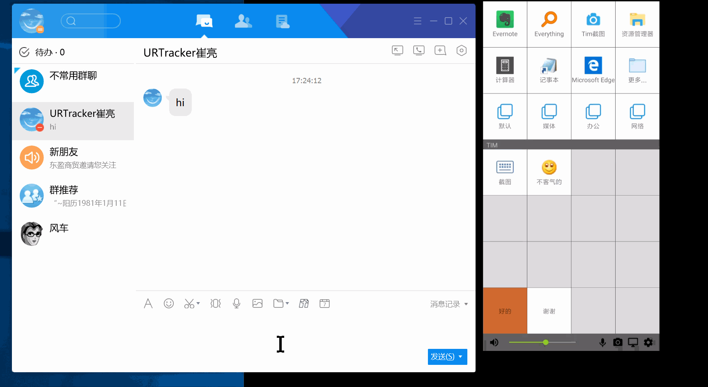
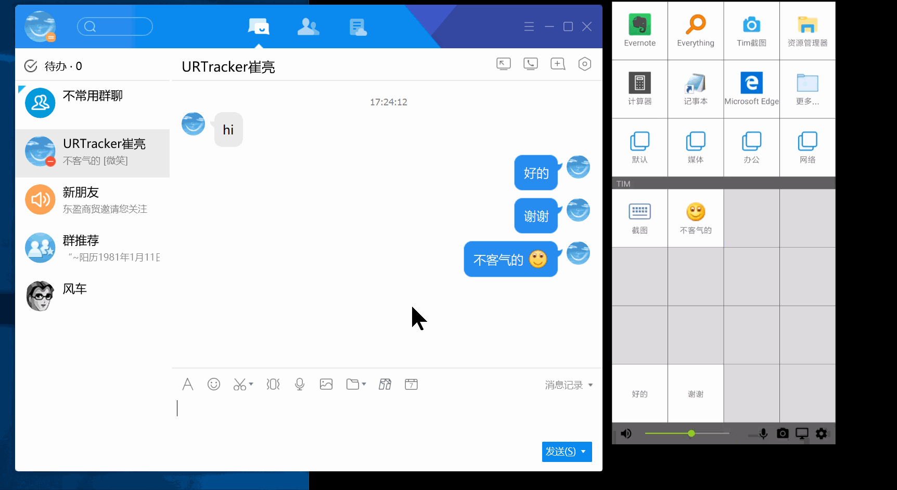
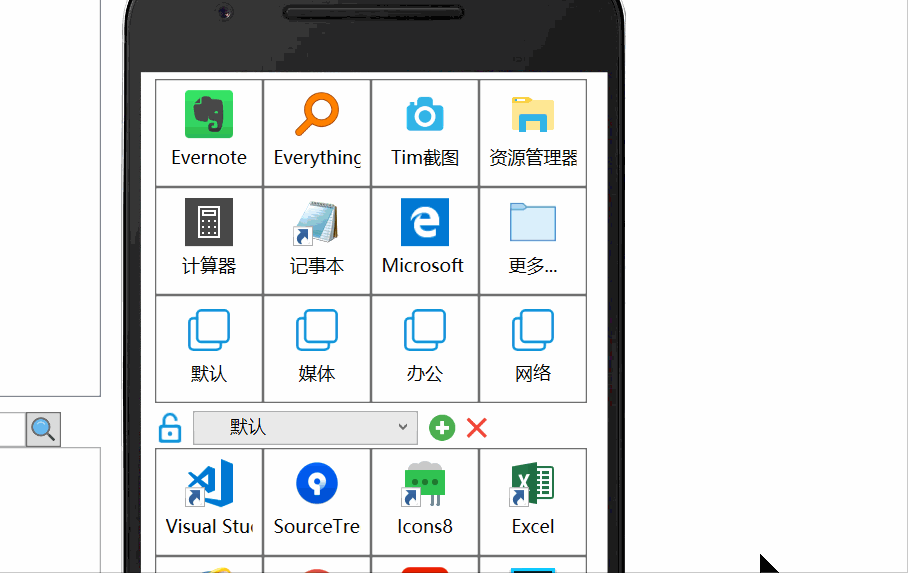
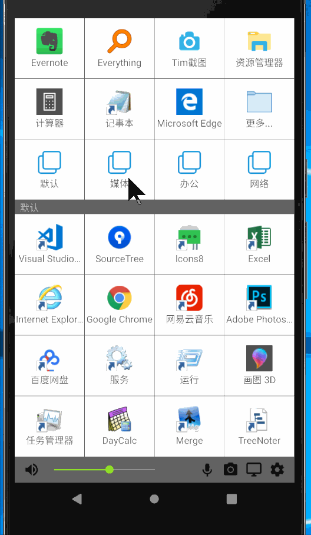

# 快捷动作类型

## 运行软件

启动一个计算机程序。

## 打开文件

打开一个Windows文件。如果文件为可执行程序（exe、bat或Auto Hot Key脚本文件等），将会启动这个程序。如果是文档或其他文件，将使用文档对应的默认软件打开此文件。

## 打开目录

用资源管理器打开一个目录。

## 网址

用系统默认浏览器打开指定的网址。

## 发送文本

将一段预先定义好的文本发送到Windows当前活动窗口。

## 发送按键

按设定的顺序发送按键到Windows当前活动窗口。

## 按钮目录

定义一个目录并在目录中放置更多的快捷动作。

## 切换配置文件

加载指定的配置文件到上下文按钮区域。

  

